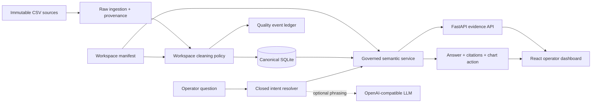

# Proofline Analytics

[](https://github.com/718232157/proofline-analytics/actions/workflows/ci.yml)

**Evidence-first analytics for questions that cannot afford invented numbers.**

Proofline is a reusable analytics platform for relational CSV and database
workspaces. It combines data-quality auditing, a governed metric layer, an
operator dashboard, and natural-language analysis whose answers remain tied to
deterministic query results.

The restaurant assignment is implemented as the first complete workspace,
`moneki`; it is a production-shaped example rather than hard-coded product
logic.

> Release candidate: complete dashboard, grounded assistant, proactive insights,
> audited data pipeline, and written demo.

## Why this is not a generic chat-with-CSV demo

1. **Evidence before eloquence** — every AI number must originate from a
   validated metric tool and include its scope.
2. **Raw data is immutable** — repairs and exclusions are recorded instead of
   silently rewriting source files.
3. **One semantic contract** — dashboard, API, AI tools, and tests share metric
   and dimension definitions.
4. **Workspace-driven** — new domains provide manifests, joins, cleaning rules,
   metrics, and labels without changing the platform core.
5. **Useful failure** — unsupported questions explain the data boundary and
   never guess.

## Delivered Moneki experience

- Daily revenue, order count, average order value, and refund visibility
- Revenue trend and Top 10 product analysis with store/date filters
- Natural-language questions backed by governed analytics tools
- Evidence cards showing filters, metric definitions, and query results
- Follow-up questions and one-click synchronization from chat to dashboard
- A visible ledger for repaired, deduplicated, and quarantined records

The current dashboard already delivers shared date filtering, governed KPI
cards, daily revenue trend, Top 10 product ranking, store-category contribution,
an auditable quality summary, and a conversational evidence drawer. Assistant
answers can synchronize their date scope back to every dashboard panel; follow-up
questions retain the prior product while changing only the requested month.
The proactive “经营脉搏” feed decomposes the latest monthly change into order
volume versus average-order-value contribution and identifies the largest
product revenue increment, again with semantic evidence IDs.
Charts are loaded as a separate bundle so the application shell remains fast on
first load.

## Architecture



The platform core owns ingestion, validation, semantic query contracts,
evidence envelopes, assistant orchestration, and reusable UI. A workspace owns
source declarations, relations, labels, metric definitions, and a small domain
policy adapter. Adding another workspace does not require restaurant logic in
the platform core.

### Technology choices

| Choice | Reason |
| --- | --- |
| FastAPI + Pydantic | Typed request/response contracts and automatic OpenAPI without a heavy server framework |
| SQLAlchemy + SQLite | Real relational joins, constraints, and reproducible zero-service startup for this data volume; the service boundary permits PostgreSQL later |
| React + TypeScript + Vite | Fast, typed interaction layer with explicit loading/error states and a small application shell |
| Recharts | Composable accessible chart primitives; loaded in a separate lazy chunk |
| Integer cents | Exact currency aggregation without binary floating-point drift |
| Pytest + Ruff + mypy + GitHub Actions | Executable numerical contracts, strict types, formatting, and a 90% coverage release gate |

Detailed decisions are recorded in [docs/ARCHITECTURE.md](docs/ARCHITECTURE.md),
and every repair/quarantine rule is documented in
[docs/DATA_QUALITY.md](docs/DATA_QUALITY.md).

## Repository layout

```text
backend/          Generic ingestion, semantic metrics, AI tools, and API
frontend/         Metadata-driven React analytics experience
workspaces/       Domain manifests and workspace-specific policy
data/             Assignment-provided, immutable Moneki POS exports
docs/             Architecture decisions and original assignment brief
AI_USAGE.md       Transparent AI-assisted development log
DEMO.md           Evidence-backed written product demonstration
```

## Local development

Prerequisites: Python 3.11+, Node.js 24+, and pnpm 11+. From a fresh machine,
the complete product runs in three steps:

```bash
git clone https://github.com/718232157/proofline-analytics.git && cd proofline-analytics
python scripts/setup.py
python scripts/dev.py
```

Setup installs dependencies from the lockfile, ingests all raw CSV rows, and
runs the audited canonicalization policy. Open `http://localhost:5173`.
Backend health check: `GET http://localhost:8000/api/health`.

Governed analytics are exposed through one contract rather than dashboard-only
queries:

```http
POST /api/workspaces/moneki/analytics/query
Content-Type: application/json

{
  "metric": "revenue",
  "filters": {"product": ["牛肉poke"]},
  "date_from": "2026-06-01",
  "date_to": "2026-06-30"
}
```

The response includes values in integer minor currency units plus a stable
evidence ID, processing-run ID, metric definition, and human-readable scope.

### Grounded assistant

`POST /api/workspaces/moneki/assistant/chat` accepts a question and optional
prior `context`. The assistant follows a strict two-stage contract:

1. A deterministic resolver handles the required operational intents. When an
   `LLM_API_KEY` is configured, an OpenAI-compatible model may map long-tail
   phrasing into the same closed intent schema; it is explicitly forbidden from
   calculating numbers.
2. The governed analytics service executes the metric query. Only its returned
   values can enter the answer and evidence citations.

Without a key, this is still a real tool chain—not canned numeric text. The
intent resolver creates a semantic query at runtime, and tests compare every
answer citation with the canonical database result. Unsupported questions
return a scoped refusal.

For pipeline development, raw ingestion remains deliberately separate from
cleaning:

```bash
cd backend
python -m app.cli ingest --workspace moneki
python -m app.cli process --workspace moneki
```

The first command validates `workspaces/moneki/workspace.toml`, imports all
12,156 source rows with provenance, and replaces the previous raw run
atomically. The second applies the deterministic repair/quarantine policy and
writes a row-level quality ledger. See [the data-quality contract](docs/DATA_QUALITY.md).

## Delivery contract

- [x] Public GitHub repository with meaningful development history
- [x] Three-step startup and architecture diagram in this README
- [x] Auditable data policy and golden metric tests
- [x] AI answers whose numbers match database results
- [x] `AI_USAGE.md` with real prompts, failures, and human-owned decisions
- [x] `DEMO.md` with required questions and verifiable evidence

## Source and attribution

The `moneki` workspace implements the public
[Moneki full-stack assignment](https://github.com/MorrisPRC/moneki-fullstack-assignment).
Its anonymized CSV files are retained as the immutable source layer.

## License

MIT. See [LICENSE](LICENSE).
