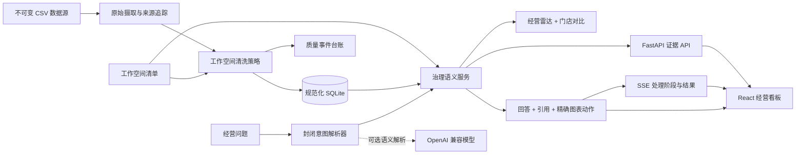

# Proofline 可信分析

[](https://github.com/718232157/proofline-analytics/actions/workflows/ci.yml)

**以证据为先，回答那些容不得编造数字的经营问题。**

Proofline 是面向关系型 CSV 与数据库工作空间的通用可信分析平台。它把数据质量审计、治理指标层、经营看板与自然语言分析整合在一起，让每个回答都能追溯到确定性的查询结果。

本次餐饮任务作为第一个完整工作空间 `moneki` 实现。它是可迁移的生产级示例，不是写死在产品中的一次性逻辑。

> 当前版本已交付可信经营雷达、门店对比、精确图表联动、流式分析助手、可审计数据管道与文字版演示。

## 为什么它不是普通的“CSV 对话”演示

1. **先证据，后表达**：AI 输出的每个数字都必须来自经过验证的指标工具，并附带查询范围。
2. **原始数据不可变**：修复与排除都会留下记录，不会静默改写源文件。
3. **统一语义契约**：看板、API、AI 工具和测试共享同一套指标与维度定义。
4. **工作空间驱动**：接入新领域只需提供清单、关联关系、清洗规则、指标与标签，无需修改平台核心。
5. **诚实地失败**：超出数据边界的问题会说明限制，绝不猜测。

## 已交付的 Moneki 体验

- 每日营业额、订单数、平均客单价及退款可见性
- 支持门店和日期筛选的营业额趋势与商品前 10 分析
- 由治理分析工具提供数字的自然语言问答
- 展示筛选范围、指标定义与查询结果的证据卡片
- 上下文追问，以及从回答一键同步到看板
- 对修复、去重和隔离记录可见的质量台账
- 基于同星期基线的最新营业日信号、环比驱动拆解和确定性行动建议
- 五家门店在营业额、订单数与客单价上的同口径对比
- 流式展示“识别问题 → 查询指标 → 数字核验”的真实处理阶段

当前看板提供统一日期筛选、治理 KPI、每日营业额趋势、商品排行、门店品类贡献、可审计质量摘要及对话式证据抽屉。助手回答可将日期范围同步到全部看板；上下文追问会保留上一个商品，只修改用户指定的月份。

“可信经营雷达”把最新营业日与最近四个同星期日的中位数比较，再结合月度订单量/客单价拆解与商品增量，形成按优先级排列的经营事项。建议由确定性规则触发，AI 只解释结果。每条事项都展示影响金额、行动建议和可追溯证据，并可定位到对应图表。图表采用独立懒加载包，确保应用外壳首屏轻量。

> 币种说明：原始文件只声明“金额”，没有提供全局币种字段；40 条记录带有 `¥`。Moneki 工作区基于中文餐饮场景和价格量级显式配置为 `CNY`。该配置只影响展示，不改变原始数值和聚合结果。

## 架构



平台核心负责数据摄取、校验、语义查询契约、证据封装、助手编排与通用界面；工作空间负责数据源声明、关联关系、标签、指标定义及少量领域策略。新增工作空间不需要把餐饮逻辑写入平台核心。

### 技术选型

| 选型 | 理由 |
| --- | --- |
| FastAPI + Pydantic | 提供强类型请求/响应契约与自动 OpenAPI，不引入笨重服务框架 |
| SQLAlchemy + SQLite | 支持真实关联、约束和零外部服务启动；现有服务边界可平滑替换 PostgreSQL |
| React + TypeScript + Vite | 类型安全、交互快速，加载和错误状态明确 |
| Recharts | 可组合的无障碍图表组件，并通过懒加载拆包 |
| 整数分 | 精确聚合货币，避免二进制浮点误差 |
| Pytest + Ruff + mypy + GitHub Actions | 把数字口径、严格类型、格式及 90% 覆盖率门槛变成可执行契约 |

详细决策见 [架构与决策记录](docs/ARCHITECTURE.md)，全部修复与隔离规则见 [数据质量契约](docs/DATA_QUALITY.md)。

## 仓库结构

```text
backend/          通用数据摄取、语义指标、AI 工具与 API
frontend/         元数据驱动的 React 分析界面
workspaces/       领域清单与工作空间专属策略
data/             任务提供且保持不可变的 Moneki POS 数据
docs/             架构决策与原始任务说明
AI_USAGE.md       可审计的 AI 辅助开发记录
DEMO.md           带证据的文字版产品演示
```

## 本地运行

前置条件：Python 3.11+、Node.js 24+、pnpm 11+。在全新环境中只需三步：

```bash
git clone https://github.com/718232157/proofline-analytics.git && cd proofline-analytics
python scripts/setup.py
python scripts/dev.py
```

初始化脚本会按锁文件安装依赖、摄取全部原始 CSV 行并执行可审计规范化策略。随后打开 `http://localhost:5173`。后端健康检查：`GET http://localhost:8000/api/health`。

治理分析统一通过以下契约开放，而不是散落在看板查询中：

```http
POST /api/workspaces/moneki/analytics/query
Content-Type: application/json

{
  "metric": "revenue",
  "filters": {"product": ["牛肉poke"]},
  "date_from": "2026-06-01",
  "date_to": "2026-06-30"
}
```

响应包含以整数最小货币单位表示的值、稳定证据 ID、处理批次 ID、指标定义和可读查询范围。

### 可信分析助手

`POST /api/workspaces/moneki/assistant/chat` 接收问题及可选的上文 `context`。助手严格遵守两阶段契约：

1. 确定性解析器处理必需的经营意图。配置 `LLM_API_KEY` 后，OpenAI 兼容模型只可把长尾表达映射到同一个封闭意图结构，明确禁止自行计算数字。
2. 治理分析服务执行指标查询。只有工具返回的值才能进入回答与证据引用。

即使没有密钥，这仍是一条真实工具链，而不是预置数字文本。意图解析器会在运行时构造语义查询，测试则逐项比对回答引用和规范数据库结果。无法支持的问题会返回边界清晰的拒答。

前端使用 `POST /api/workspaces/moneki/assistant/chat/stream` 的 SSE 契约，依次收到意图识别、治理查询、数字核验和最终结构化结果。流式阶段来自真实执行路径，不是模拟打字动画；最终数字仍只存在于 `result` 事件的治理查询结果中。

这里有两类 API，不能混为一谈：`/analytics/query` 是必需的真实数字工具，本地运行时会查询规范数据库；DeepSeek 等外部 LLM API 只是可选的语言理解增强。没有密钥时，确定性解析器仍会构造真实 `AnalyticsQuery`，不是把答案或数字写死。

如需验证真实大模型接入，可复制 `.env.example` 为 `.env`，填写评审者自己的 `LLM_API_KEY`，并按供应商调整 `LLM_BASE_URL` 与 `LLM_MODEL`。默认配置使用 DeepSeek 当前的 OpenAI 兼容地址与 `deepseek-v4-flash`；密钥只用于把长尾表达映射到封闭意图，营业额、订单数和客单价始终由后端治理查询计算。密钥不得提交到仓库。

启动后访问 `GET http://localhost:8000/api/health` 可核验运行模式：未配置密钥时 `assistant_mode=deterministic`；配置后为 `hybrid_llm` 并展示模型名称；两种模式的 `numeric_source` 都必须是 `governed_analytics_api`。修改 `.env` 后需要重启 `python scripts/dev.py`。

### Docker 一键体验

仓库包含单容器生产构建：前端静态资源与 API 同源提供，启动时自动摄取并处理数据，SQLite 文件保存在命名卷中。

```bash
docker compose up --build -d
```

打开 `http://localhost:8080`。该方式也适用于现有 Linux 服务器；默认只占用 8080 端口，不修改服务器上已有的 80/443 服务。实际公网发布前仍应由服务器所有者确认防火墙、反向代理和访问策略。

开发数据管道时，原始摄取与清洗有意分离：

```bash
cd backend
python -m app.cli ingest --workspace moneki
python -m app.cli process --workspace moneki
```

第一条命令校验 `workspaces/moneki/workspace.toml`，带来源信息导入全部 12,156 行数据，并以事务方式替换上一次原始批次。第二条命令执行确定性修复/隔离策略并写入逐行质量台账。详见[数据质量契约](docs/DATA_QUALITY.md)。

## 交付检查

- [x] GitHub 公开仓库及有意义的开发提交历史
- [x] 三步启动说明及 README 架构图
- [x] 可审计数据策略与黄金指标测试
- [x] AI 回答数字与数据库结果一致
- [x] `AI_USAGE.md` 记录真实提示词、失败案例及人工决策
- [x] `DEMO.md` 覆盖必问题目并提供可验证证据
- [x] 三类必问题精确定位到品类、商品/日期或客单价图表
- [x] SSE 流式处理状态与结构化最终结果
- [x] 可信经营雷达与门店经营对比
- [x] Docker 隔离部署材料（不占用现有 80/443）

## 数据来源与致谢

`moneki` 工作空间实现自公开的 [Moneki 全栈作业](https://github.com/MorrisPRC/moneki-fullstack-assignment)，其中匿名 CSV 文件作为不可变原始数据层保留。

## 许可证

MIT，详见 [LICENSE](LICENSE)。
