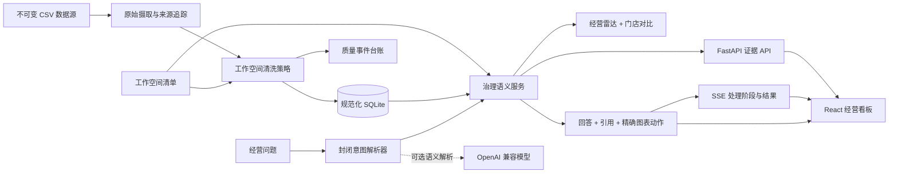

# Proofline 可信分析

[](https://github.com/718232157/proofline-analytics/actions/workflows/ci.yml)
[](https://proofline-analytics-718232157.onrender.com)

**以证据为先，回答那些容不得编造数字的经营问题。**

Proofline 是面向多门店运营团队的可信经营分析平台。它把脏数据治理、统一指标、主动经营信号与自然语言分析整合在一起，让运营人员先看到“今天最值得处理什么”，再追溯“这个结论是怎么算出来的”。

Moneki 餐饮数据是第一个完整工作空间，但产品能力并未写死在三道题或餐饮文案中：同一套摄取、语义查询、证据、拒答和图表动作可由工作空间配置迁移到零售、门店服务等场景。

> 当前版本已交付可信经营雷达、门店对比、精确图表联动、流式分析助手、可审计数据管道与文字版演示。

## 一键在线体验

点击 README 顶部的 **在线体验** 即可直接进入 Proofline，无需登录、下载仓库、配置数据库或提供模型密钥。在线版本运行与仓库一致的真实数据管道、SQLite 数据库、治理分析 API 和前端，不是静态截图或预置回答。

服务使用 Render 免费实例：连续 15 分钟无人访问后会休眠，下一位用户首次唤醒通常需要约一分钟，Render 会提供加载页；唤醒后可直接使用。容器每次启动都会从仓库中的不可变 CSV 重新摄取、清洗并构建派生数据库，因此免费实例的临时磁盘不会造成源数据或口径丢失。

## 它创造什么市场价值

**核心用户**是每天需要从 POS、ERP 或表格导出中判断经营状况的区域运营、门店负责人和经营分析人员。他们真正的问题通常不是“能不能画图”，而是：数据脏且口径不一、异常出现得太晚、临时问题依赖分析师，以及 AI 给出的数字无法复核。

Proofline 对应一条可以每天重复的工作流：

1. 导入关系型业务数据，自动修复确定性问题，将不可安全推断的数据隔离并留痕。
2. 用统一语义层计算营业额、订单、客单价等经营指标，避免看板和问答各算一套。
3. 首页主动按影响与紧迫度排列经营信号，而不是要求用户自己翻图找问题。
4. 用户用自然语言继续追问，回答可一键定位到对应日期、商品、品类或门店。
5. 每个数字都能回到处理批次、查询范围和指标定义，便于复核与协作。

产品差异不在“又一个 AI 聊天框”，而在**可信数据管道 + 受约束语义层 + 决策型交互**。继续产品化时，可以在现有工作空间协议上增加数据库连接器、定时摄取、企业权限、消息预警和跨区域基准，而无需重写数字可信链路。

## 为什么它不是普通的“CSV 对话”演示

1. **先证据，后表达**：AI 输出的每个数字都必须来自经过验证的指标工具，并附带查询范围。
2. **原始数据不可变**：修复与排除都会留下记录，不会静默改写源文件。
3. **统一语义契约**：看板、API、AI 工具和测试共享同一套指标与维度定义。
4. **工作空间驱动**：接入新领域只需提供清单、关联关系、清洗规则、指标与标签，无需修改平台核心。
5. **诚实地失败**：超出数据边界的问题会说明限制，绝不猜测。

## 已交付的 Moneki 体验

- 每日营业额、订单数、平均客单价及退款可见性
- 支持门店和日期筛选的营业额趋势与商品前 10 分析
- 由治理分析工具提供数字的自然语言问答
- 展示筛选范围、指标定义与查询结果的证据卡片
- 上下文追问，以及从回答一键同步到看板
- 对修复、去重和隔离记录可见的质量台账
- 基于同星期基线的最新营业日信号、环比驱动拆解和确定性行动建议
- 五家门店在营业额、订单数与客单价上的同口径对比
- 流式展示“识别问题 → 查询指标 → 数字核验”的真实处理阶段

当前看板提供统一日期筛选、治理 KPI、每日营业额趋势、商品排行、门店品类贡献、可审计质量摘要及对话式证据抽屉。助手回答可将日期范围同步到全部看板；上下文追问会保留上一个商品，只修改用户指定的月份。

“可信经营雷达”把最新营业日与最近四个同星期日的中位数比较，再结合月度订单量/客单价拆解与商品增量，形成按优先级排列的经营事项。建议由确定性规则触发，AI 只解释结果。每条事项都展示影响金额、行动建议和可追溯证据，并可定位到对应图表。图表采用独立懒加载包，确保应用外壳首屏轻量。

> 币种说明：原始文件只声明“金额”，没有提供全局币种字段；40 条记录带有 `¥`。Moneki 工作区基于中文餐饮场景和价格量级显式配置为 `CNY`。该配置只影响展示，不改变原始数值和聚合结果。

### 对模糊业务口径的处理

源数据不能回答的事情，系统不会假装它已经回答：

| 模糊点 | 当前决策 | 理由与边界 |
| --- | --- | --- |
| 金额币种未全局声明 | 工作空间展示为人民币 CNY | 中文餐饮任务语境、部分原始金额含 `¥`、商品价格量级共同支持这一展示假设；但它仍是显式配置，不被写成原始事实。更换工作空间配置即可切换币种，底层整数金额不变 |
| “营业额”是否扣退款 | 定义为已接受记录金额之和，保留负数退款 | 删除负数会虚增收入；退款数量和金额在质量台账中单独可见 |
| 缺失金额能否补算 | 隔离，不用数量 × 单价猜测 | 数据没有折扣、优惠和改价字段，补算可能制造业务事实 |
| 订单数如何计算 | 已接受记录中的唯一订单号 | 一张订单可包含多个商品行，按行数统计会夸大订单量 |
| 支付方式是否进入主看板 | 保留在规范数据层，暂不占首页 | 五种方式的订单占比都约为 20%，门店间范围仅 18.2%–21.1%，当前又没有手续费、失败率、到账周期或储值余额，展示占比无法导向行动 |
| AI 能否回答未来或数据外问题 | 明确拒答 | 当前可信数据只覆盖 2026-05-01 至 2026-07-31，不能用常识补造未来经营数字 |

## 架构



平台核心负责数据摄取、校验、语义查询契约、证据封装、助手编排与通用界面；工作空间负责数据源声明、关联关系、标签、指标定义及少量领域策略。新增工作空间不需要把餐饮逻辑写入平台核心。

### 技术选型

| 选型 | 理由 |
| --- | --- |
| FastAPI + Pydantic | 提供强类型请求/响应契约与自动 OpenAPI，不引入笨重服务框架 |
| SQLAlchemy + SQLite | 支持真实关联、约束和零外部服务启动；现有服务边界可平滑替换 PostgreSQL |
| React + TypeScript + Vite | 类型安全、交互快速，加载和错误状态明确 |
| Recharts | 可组合的无障碍图表组件，并通过懒加载拆包 |
| 整数分 | 精确聚合货币，避免二进制浮点误差 |
| Pytest + Ruff + mypy + GitHub Actions | 把数字口径、严格类型、格式及 90% 覆盖率门槛变成可执行契约 |

详细决策见 [架构与决策记录](docs/ARCHITECTURE.md)，全部修复与隔离规则见 [数据质量契约](docs/DATA_QUALITY.md)。

## 仓库结构

```text
backend/          通用数据摄取、语义指标、AI 工具与 API
frontend/         元数据驱动的 React 分析界面
workspaces/       领域清单与工作空间专属策略
data/             任务提供且保持不可变的 Moneki POS 数据
docs/             架构决策与原始任务说明
render.yaml       Render 免费在线服务配置
AI_USAGE.md       可审计的 AI 辅助开发记录
DEMO.md           带证据的文字版产品演示
```

## 本地运行

前置条件：Python 3.11+、Node.js 24+、pnpm 11+。在全新环境中只需三步：

```bash
git clone https://github.com/718232157/proofline-analytics.git && cd proofline-analytics
python scripts/setup.py
python scripts/dev.py
```

初始化脚本会按锁文件安装依赖、摄取全部原始 CSV 行并执行可审计规范化策略。随后打开 `http://localhost:5173`。后端健康检查：`GET http://localhost:8000/api/health`。

治理分析统一通过以下契约开放，而不是散落在看板查询中：

```http
POST /api/workspaces/moneki/analytics/query
Content-Type: application/json

{
  "metric": "revenue",
  "filters": {"product": ["牛肉poke"]},
  "date_from": "2026-06-01",
  "date_to": "2026-06-30"
}
```

响应包含以整数最小货币单位表示的值、稳定证据 ID、处理批次 ID、指标定义和可读查询范围。

### 可信分析助手

`POST /api/workspaces/moneki/assistant/chat` 接收问题及可选的上文 `context`。助手严格遵守两阶段契约：

1. 确定性解析器处理必需的经营意图。配置 `LLM_API_KEY` 后，OpenAI 兼容模型只可把长尾表达映射到同一个封闭意图结构，明确禁止自行计算数字。
2. 治理分析服务执行指标查询。只有工具返回的值才能进入回答与证据引用。

即使没有密钥，这仍是一条真实工具链，而不是预置数字文本。意图解析器会在运行时构造语义查询，测试则逐项比对回答引用和规范数据库结果。无法支持的问题会返回边界清晰的拒答。

前端使用 `POST /api/workspaces/moneki/assistant/chat/stream` 的 SSE 契约，依次收到意图识别、治理查询、数字核验和最终结构化结果。流式阶段来自真实执行路径，不是模拟打字动画；最终数字仍只存在于 `result` 事件的治理查询结果中。

这里有两类 API，不能混为一谈：`/analytics/query` 是必需的真实数字工具，本地运行时会查询规范数据库；DeepSeek 等外部 LLM API 只是可选的语言理解增强。没有密钥时，确定性解析器仍会构造真实 `AnalyticsQuery`，不是把答案或数字写死。

#### 为什么仓库默认没有绑定真实外部模型

这不是把“大模型响应 mock 掉”，而是刻意把**语言理解**与**数字事实**拆开：

- 产品的核心分析能力不应依赖某个开发者的私有密钥、账户余额或单一供应商可用性。
- API Key 不能安全提交到公开仓库；把作者密钥放到前端还会造成泄露和滥用风险。
- 三个必问及常见运营表达用确定性解析更稳定、成本为零、结果可回归。
- 外部模型即使接入，也只允许输出 `{intent, product, month}`，不能写 SQL、计算金额或把任何数字带进答案。

因此，默认模式是真实的“解析器 → 治理分析 API → 数据库 → 证据回答”调用链，只是没有向第三方发送语言请求。代码已经实现 OpenAI 兼容模型适配器；部署方通过环境变量提供自己的 DeepSeek、OpenAI 或其他兼容服务密钥后，会自动进入混合模式。无论是否接模型，数字来源始终是 `governed_analytics_api`。

**验证边界也明确公开：** 当前版本没有使用可共享的付费密钥做真实供应商端到端调用，因此不把“在线模型已实测”列为产品能力。自动化测试使用受控 HTTP 响应验证请求协议、封闭输出结构和故障兜底；数字工具链、数据库查询和经营回答则全部使用真实本地数据运行。示例 DeepSeek 地址与模型名来自其[官方 API 文档](https://api-docs.deepseek.com/quick_start/pricing-details-cny/)，部署方提供自己的密钥后即可执行在线验收。

如需验证真实大模型接入，可复制 `.env.example` 为 `.env`，填写部署环境自己的 `LLM_API_KEY`，并按供应商调整 `LLM_BASE_URL` 与 `LLM_MODEL`。默认配置使用 DeepSeek 当前的 OpenAI 兼容地址与 `deepseek-v4-flash`；密钥只用于把长尾表达映射到封闭意图，营业额、订单数和客单价始终由后端治理查询计算。密钥不得提交到仓库。

启动后访问 `GET http://localhost:8000/api/health` 可核验运行模式：未配置密钥时 `assistant_mode=deterministic`；配置后为 `hybrid_llm` 并展示模型名称；两种模式的 `numeric_source` 都必须是 `governed_analytics_api`。修改 `.env` 后需要重启 `python scripts/dev.py`。

### 数字一致性验证

仓库提供一个只关注三道必问题的独立验证文件：[test_ai_answer_verification.py](backend/tests/test_ai_answer_verification.py)。每个测试都会先直接调用语义服务取得数据库查询结果，再调用助手；测试比较的是两条独立执行路径，不是拿回答和同一份硬编码文案互相证明。

```bash
cd backend
# Windows
.venv/Scripts/python -m pytest tests/test_ai_answer_verification.py -vv
# macOS / Linux
.venv/bin/python -m pytest tests/test_ai_answer_verification.py -vv
```

预期结果会明确列出三项：

```text
test_category_answer_equals_independent_database_query PASSED
test_product_month_answer_equals_independent_database_query PASSED
test_aov_trend_answer_equals_independent_database_query PASSED
```

证明关系如下：

```text
独立数据库查询值 = 助手 citation.value = 回答中的 display_value
```

此外，完整测试还覆盖“那五月呢？”的上下文继承、商品简称、多商品歧义、日期越界、无依据拒答、清洗黄金值及 90% 覆盖率门槛。公开仓库顶部的 CI 徽章和 [GitHub Actions](https://github.com/718232157/proofline-analytics/actions/workflows/ci.yml) 可作为无需本机环境的在线执行证据。

### Docker 一键体验

仓库包含单容器生产构建：前端静态资源与 API 同源提供，启动时自动摄取并处理数据，SQLite 文件保存在命名卷中。

```bash
docker compose up --build -d
```

打开 `http://localhost:8080`。该方式也适用于现有 Linux 服务器；默认只占用 8080 端口，不修改服务器上已有的 80/443 服务。实际公网发布前仍应由服务器所有者确认防火墙、反向代理和访问策略。

开发数据管道时，原始摄取与清洗有意分离：

```bash
cd backend
python -m app.cli ingest --workspace moneki
python -m app.cli process --workspace moneki
```

第一条命令校验 `workspaces/moneki/workspace.toml`，带来源信息导入全部 12,156 行数据，并以事务方式替换上一次原始批次。第二条命令执行确定性修复/隔离策略并写入逐行质量台账。详见[数据质量契约](docs/DATA_QUALITY.md)。

## 作业交付核对（产品文档的附录）

- [x] GitHub 公开仓库及有意义的开发提交历史
- [x] 三步启动说明及 README 架构图
- [x] 可审计数据策略与黄金指标测试
- [x] AI 回答数字与数据库结果一致
- [x] `AI_USAGE.md` 记录真实提示词、失败案例及人工决策
- [x] `DEMO.md` 覆盖必问题目并提供可验证证据
- [x] 三类必问题精确定位到品类、商品/日期或客单价图表
- [x] SSE 流式处理状态与结构化最终结果
- [x] 可信经营雷达与门店经营对比
- [x] Docker 隔离部署材料（不占用现有 80/443）

## 数据来源与致谢

`moneki` 工作空间实现自公开的 [Moneki 全栈作业](https://github.com/MorrisPRC/moneki-fullstack-assignment)，其中匿名 CSV 文件作为不可变原始数据层保留。

## 许可证

MIT，详见 [LICENSE](LICENSE)。
