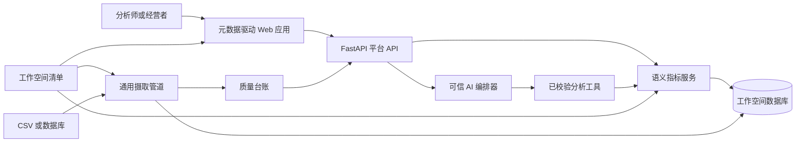

# 架构与决策记录

本文记录影响正确性、可运维性、复用能力或产品信任的决策；当证据改变决策时，本文也必须同步更新。

## 平台与工作空间边界

## 复用契约

平台负责数据源适配器、验证原语、证据封装、语义查询契约、AI 编排和界面组件。工作空间负责数据源声明、关联关系、领域清洗规则、指标、维度、标签与推荐问题。

首个版本采用配置加少量 Python 策略钩子，不追求无代码摄取编辑器；后者会显著扩大范围，却不能增强当前产品最关键的可信度证明。

## ADR-001：受限语义工具，而非自由文本转 SQL

**状态：已采纳**

模型可以理解意图和选择工具，但不得提供表名、列名或可执行 SQL。工具参数只能使用当前工作空间注册的指标与维度标识；SQL 始终由指标服务确定性、参数化地生成。

这一选择牺牲部分开放式查询覆盖，换取数字可靠性、可复用治理、清晰测试边界和可用的降级路径。

## ADR-002：存储边界后的 SQLite

**状态：已采纳**

参考工作空间约有 1.2 万条事实记录。SQLite 支持关联和索引，可重复启动，且无需用户预先安装和维护独立数据库。货币以整数分存储。持久化经服务访问，未来可增加 PostgreSQL 适配器而无需修改 API、语义查询、证据或 AI 契约。

## ADR-003：原始层、规范层与隔离层

**状态：已采纳**

原始记录保持不可变；确定性标准化生成规范记录；歧义或无效记录连同原因码写入质量台账。看板与 AI 始终查询同一份规范数据。

## ADR-004：最小货币单位与证据封装

**状态：已采纳**

货币聚合跨服务边界时使用整数最小单位。比率指标在最小单位中保留两位小数，并由客户端按展示规则舍入，避免营业额出现浮点漂移，同时正确呈现平均客单价。

每个语义结果都包含由已校验查询和规范处理批次生成的稳定证据 ID，以及指标定义和筛选范围。看板与 AI 因而能引用同一次计算，无需暴露原始 SQL。

## ADR-005：模型负责理解，确定性工具负责计算

**状态：已采纳**

可选的 OpenAI 兼容模型接收问题、上文及封闭意图结构，但不能提交 SQL 或指标值。编排器验证结构化输出、构造 `AnalyticsQuery`、执行语义服务并从结果生成引用。

必问题目另有本地确定性解析器，确保无凭据也能复现。模型超时、输出格式错误、意图不支持或问题越界时均安全拒答，而非生成无依据结论。

助手同时返回强类型 `ChartAction`。客户端把同一已校验查询范围应用到看板，使对话和可视化保持同一事实来源。追问上下文通过显式请求/响应传递，不依赖隐藏服务器记忆。

## ADR-006：先做确定性主动洞察，再考虑生成建议

**状态：已采纳**

Proofline 基于治理指标计算同星期日基线、环比表现拆解与商品增长驱动，其算法、输入和证据 ID 均可检查。行动建议由与信号类型绑定的确定性规则产生；未来 LLM 可以润色或排序这些发现，但不会代替确定性代码发现可证明的数字模式。

## ADR-007：图表动作是强类型产品契约

**状态：已采纳**

助手返回的图表动作必须声明目标区域、治理查询与可选高亮实体。客户端只执行该结构，不解析回答文案。品类、商品月份、客单价趋势和门店比较分别定位到独立视图，避免“按钮存在但实际只滚动到顶部”的伪联动。

## ADR-008：流式传输执行阶段，不流式编造答案

**状态：已采纳**

SSE 端点发送意图识别、治理查询和数字核验状态，最终一次发送经过验证的结构化结果。数字不会出现在未完成的模型 token 中，因此流式体验不会削弱证据优先契约。

## ADR-009：单容器同源部署

**状态：已采纳**

生产镜像在构建阶段生成前端静态资源，由 FastAPI 同源提供页面与 API；运行时自动执行幂等摄取与处理，SQLite 放入独立命名卷。默认映射 8080，不接管宿主机 80/443，便于与现有项目隔离部署。

## 外部设计参考

- [Vanna](https://github.com/vanna-ai/vanna)：工具执行、审计能力与结构化结果
- [Evidence](https://github.com/evidence-dev/evidence)：SQL 支撑的证据与可复现报告
- [Recharts](https://github.com/recharts/recharts)：可组合 React 图表原语

以上项目只提供原则参考。Proofline 使用独立、更小的架构，未复制其源代码。
