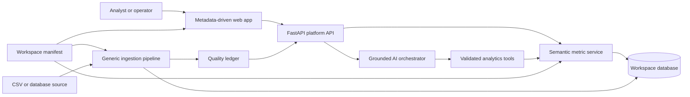

# Architecture and Decision Record

This document records decisions that affect correctness, operability, reuse, or
product trust. It changes when evidence changes a decision.

## Platform and workspace boundary

## Reuse contract

The platform owns source adapters, validation primitives, evidence envelopes,
the semantic query contract, AI orchestration, and UI components. A workspace
owns source declarations, relations, domain cleaning rules, metrics,
dimensions, labels, and suggested questions.

The first release supports configuration plus small Python policy hooks. It
does not attempt a no-code ingestion builder; that would add surface area
without improving this assignment's proof of trust.

## ADR-001: Restricted semantic tools instead of free text-to-SQL

**Status:** Accepted

The model may interpret intent and select a tool, but it cannot provide table
names, column names, or executable SQL. Tool arguments use metric and dimension
identifiers registered by the active workspace. SQL remains deterministic and
parameterized inside the metric service.

This trades open-ended query coverage for numerical reliability, reusable
governance, clear testing boundaries, and useful fallback behavior.

## ADR-002: SQLite behind a storage boundary

**Status:** Accepted

The reference workspace has roughly twelve thousand fact rows. SQLite keeps
startup reproducible, supports joins and indexes, and avoids making Docker a
requirement for evaluation. Money is stored as integer cents.

Persistence is accessed through services so a PostgreSQL adapter can be added
without changing API, semantic query, evidence, or AI contracts.

## ADR-003: Raw, canonical, and quarantine layers

**Status:** Accepted

Raw rows remain immutable. Deterministic normalization produces canonical
records, while ambiguous or invalid records are written to a quality ledger
with reason codes. Dashboard and AI queries use the same canonical dataset.

## External design references

- [Vanna](https://github.com/vanna-ai/vanna): tool execution, auditability, and structured results
- [Evidence](https://github.com/evidence-dev/evidence): SQL-backed evidence and reproducible reporting
- [Recharts](https://github.com/recharts/recharts): composable React chart primitives

These projects inform principles only. Proofline implements an independent,
smaller architecture and does not copy their source code.
